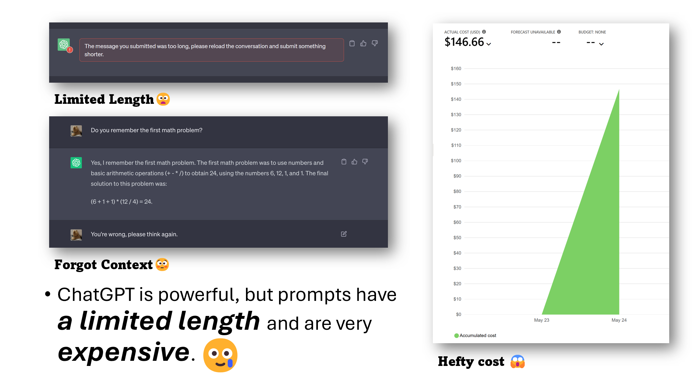
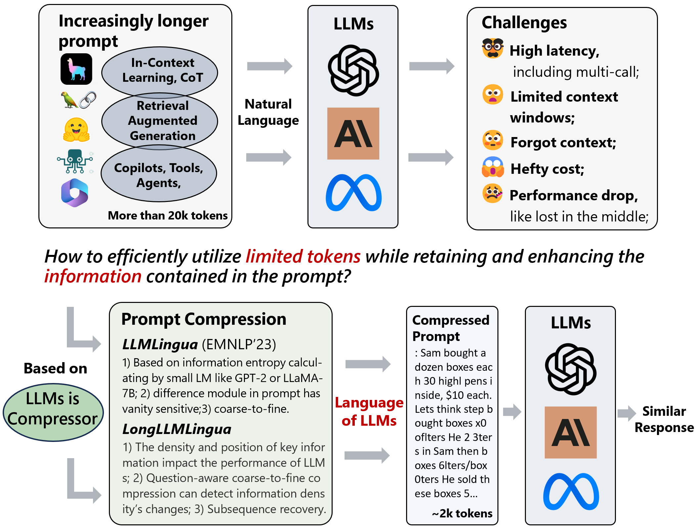
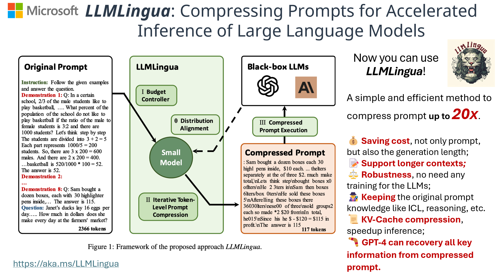
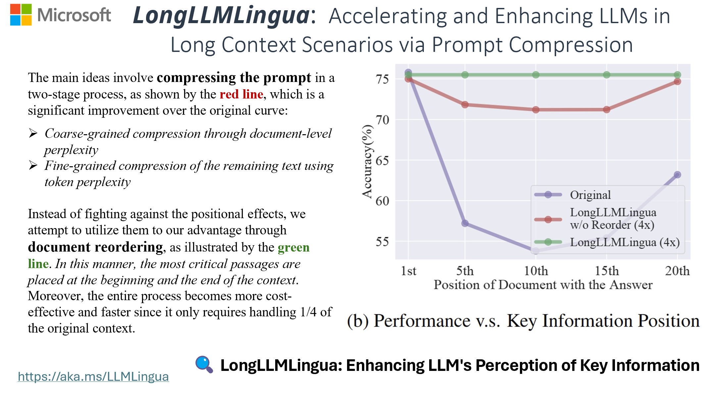
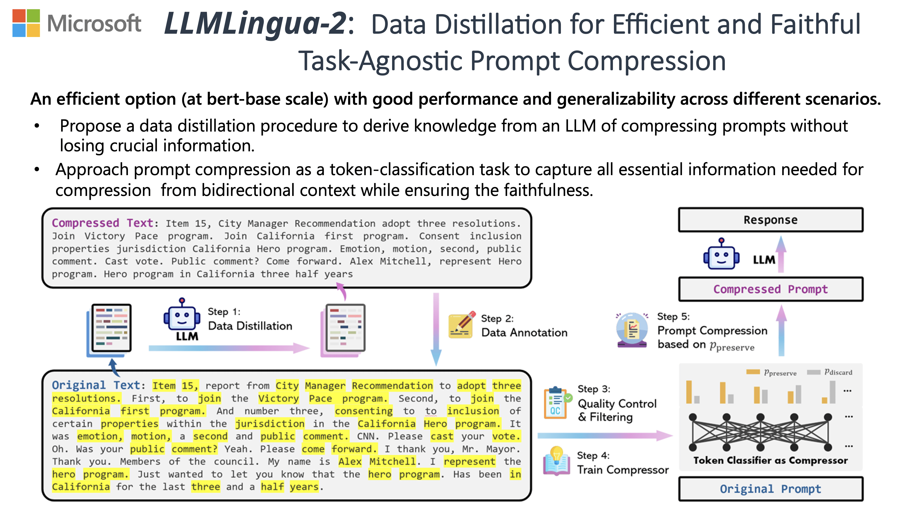

<div style="display: flex; align-items: center;">
    <div style="width: 100px; margin-right: 10px; height:auto;" align="left">
        
    </div>
    <div style="flex-grow: 1;" align="center">
        <h2 align="center">LLMLingua Series | Effectively Deliver Information to LLMs via Prompt Compression</h2>
    </div>
</div>

<p align="center">
    | <a href="https://llmlingua.com/"><b>Project Page</b></a> |
    <a href="https://aclanthology.org/2023.emnlp-main.825/"><b>LLMLingua</b></a> |
    <a href="https://aclanthology.org/2024.acl-long.91/"><b>LongLLMLingua</b></a> |
    <a href="https://aclanthology.org/2024.findings-acl.57/"><b>LLMLingua-2</b></a> |
    <a href="https://huggingface.co/spaces/microsoft/LLMLingua"><b>LLMLingua Demo</b></a> |
    <a href="https://huggingface.co/spaces/microsoft/LLMLingua-2"><b>LLMLingua-2 Demo</b></a> |
</p>

https://github.com/microsoft/LLMLingua/assets/30883354/eb0ea70d-6d4c-4aa7-8977-61f94bb87438

## News
- 🍩 [24/12/13] We are excited to announce the release of our KV cache-centric analysis work, [SCBench](https://aka.ms/SCBench), which evaluates long-context methods from a KV cache perspective.
- 👘 [24/09/16] We are pleased to announce the release of our KV cache offloading work, [RetrievalAttention](https://aka.ms/RetrievalAttention), which accelerates long-context LLM inference via vector retrieval.
- 🌀  [24/07/03] We're excited to announce the release of [MInference](https://aka.ms/MInference) to speed up Long-context LLMs' inference, reduces inference latency by up to **10X** for pre-filling on an A100 while maintaining accuracy in **1M tokens prompt**! For more information, check out our [paper](https://arxiv.org/abs/2407.02490), visit the [project page](https://aka.ms/MInference).
- 🧩 LLMLingua has been integrated into [Prompt flow](https://microsoft.github.io/promptflow/integrations/tools/llmlingua-prompt-compression-tool.html), a streamlined tool framework for LLM-based AI applications.
- 🦚 We're excited to announce the release of **LLMLingua-2**, boasting a 3x-6x speed improvement over LLMLingua! For more information, check out our [paper](https://aclanthology.org/2024.findings-acl.57/), visit the [project page](https://llmlingua.com/llmlingua2.html), and explore our [demo](https://huggingface.co/spaces/microsoft/LLMLingua-2).
- 👾 LLMLingua has been integrated into [LangChain](https://github.com/langchain-ai/langchain/blob/master/docs/docs/integrations/retrievers/llmlingua.ipynb) and [LlamaIndex](https://github.com/run-llama/llama_index/blob/main/docs/examples/node_postprocessor/LongLLMLingua.ipynb), two widely-used RAG frameworks.
- 🤳 Talk slides are available in [AI Time Jan, 24](https://drive.google.com/file/d/1fzK3wOvy2boF7XzaYuq2bQ3jFeP1WMk3/view?usp=sharing).
- 🖥 EMNLP'23 slides are available in [Session 5](https://drive.google.com/file/d/1GxQLAEN8bBB2yiEdQdW4UKoJzZc0es9t/view) and [BoF-6](https://drive.google.com/file/d/1LJBUfJrKxbpdkwo13SgPOqugk-UjLVIF/view).
- 📚 Check out our new [blog post](https://medium.com/@iofu728/longllmlingua-bye-bye-to-middle-loss-and-save-on-your-rag-costs-via-prompt-compression-54b559b9ddf7) discussing RAG benefits and cost savings through prompt compression. See the script example [here](https://github.com/microsoft/LLMLingua/blob/main/examples/Retrieval.ipynb).
- 🎈 Visit our [project page](https://llmlingua.com/) for real-world case studies in RAG, Online Meetings, CoT, and Code.
- 👨‍🦯 Explore our ['./examples'](./examples) directory for practical applications, including [LLMLingua-2](./examples/LLMLingua2.ipynb), [RAG](./examples/RAG.ipynb), [Online Meeting](./examples/OnlineMeeting.ipynb), [CoT](./examples/CoT.ipynb), [Code](./examples/Code.ipynb), and [RAG using LlamaIndex](./examples/RAGLlamaIndex.ipynb).

## TL;DR

LLMLingua utilizes a compact, well-trained language model (e.g., GPT2-small, LLaMA-7B) to identify and remove non-essential tokens in prompts. This approach enables efficient inference with large language models (LLMs), achieving up to 20x compression with minimal performance loss.

- [LLMLingua: Compressing Prompts for Accelerated Inference of Large Language Models](https://aclanthology.org/2023.emnlp-main.825/) (EMNLP 2023)<br>
  _Huiqiang Jiang, Qianhui Wu, Chin-Yew Lin, Yuqing Yang and Lili Qiu_

LongLLMLingua mitigates the 'lost in the middle' issue in LLMs, enhancing long-context information processing. It reduces costs and boosts efficiency with prompt compression, improving RAG performance by up to 21.4% using only 1/4 of the tokens.

- [LongLLMLingua: Accelerating and Enhancing LLMs in Long Context Scenarios via Prompt Compression](https://aclanthology.org/2024.acl-long.91/) (ACL 2024 and ICLR ME-FoMo 2024)<br>
  _Huiqiang Jiang, Qianhui Wu, Xufang Luo, Dongsheng Li, Chin-Yew Lin, Yuqing Yang and Lili Qiu_

LLMLingua-2, a small-size yet powerful prompt compression method trained via data distillation from GPT-4 for token classification with a BERT-level encoder, excels in task-agnostic compression. It surpasses LLMLingua in handling out-of-domain data, offering 3x-6x faster performance.

- [LLMLingua-2: Data Distillation for Efficient and Faithful Task-Agnostic Prompt Compression](https://aclanthology.org/2024.findings-acl.57/) (ACL 2024 Findings)<br>
  _Zhuoshi Pan, Qianhui Wu, Huiqiang Jiang, Menglin Xia, Xufang Luo, Jue Zhang, Qingwei Lin, Victor Ruhle, Yuqing Yang, Chin-Yew Lin, H. Vicky Zhao, Lili Qiu, Dongmei Zhang_

## 🎥 Overview



- Ever encountered the token limit when asking ChatGPT to summarize lengthy texts?
- Frustrated with ChatGPT forgetting previous instructions after extensive fine-tuning?
- Experienced high costs using GPT3.5/4 API for experiments despite excellent results?

While Large Language Models like ChatGPT and GPT-4 excel in generalization and reasoning, they often face challenges like prompt length limits and prompt-based pricing schemes.



Now you can use **LLMLingua**, **LongLLMLingua**, and **LLMLingua-2**!

These tools offer an efficient solution to compress prompts by up to **20x**, enhancing the utility of LLMs.

- 💰 **Cost Savings**: Reduces both prompt and generation lengths with minimal overhead.
- 📝 **Extended Context Support**: Enhances support for longer contexts, mitigates the "lost in the middle" issue, and boosts overall performance.
- ⚖️ **Robustness**: No additional training needed for LLMs.
- 🕵️ **Knowledge Retention**: Maintains original prompt information like ICL and reasoning.
- 📜 **KV-Cache Compression**: Accelerates inference process.
- 🪃 **Comprehensive Recovery**: GPT-4 can recover all key information from compressed prompts.







PS: This demo is based on the [alt-gpt](https://github.com/feedox/alt-gpt) project. Special thanks to @Livshitz for their valuable contribution.

If you find this repo helpful, please cite the following papers:

```bibtex
@inproceedings{jiang-etal-2023-llmlingua,
    title = "{LLML}ingua: Compressing Prompts for Accelerated Inference of Large Language Models",
    author = "Huiqiang Jiang and Qianhui Wu and Chin-Yew Lin and Yuqing Yang and Lili Qiu",
    editor = "Bouamor, Houda  and
      Pino, Juan  and
      Bali, Kalika",
    booktitle = "Proceedings of the 2023 Conference on Empirical Methods in Natural Language Processing",
    month = dec,
    year = "2023",
    address = "Singapore",
    publisher = "Association for Computational Linguistics",
    url = "https://aclanthology.org/2023.emnlp-main.825",
    doi = "10.18653/v1/2023.emnlp-main.825",
    pages = "13358--13376",
}
```

```bibtex
@inproceedings{jiang-etal-2024-longllmlingua,
    title = "{L}ong{LLML}ingua: Accelerating and Enhancing {LLM}s in Long Context Scenarios via Prompt Compression",
    author = "Huiqiang Jiang and Qianhui Wu and and Xufang Luo and Dongsheng Li and Chin-Yew Lin and Yuqing Yang and Lili Qiu",
    editor = "Ku, Lun-Wei  and
      Martins, Andre  and
      Srikumar, Vivek",
    booktitle = "Proceedings of the 62nd Annual Meeting of the Association for Computational Linguistics (Volume 1: Long Papers)",
    month = aug,
    year = "2024",
    address = "Bangkok, Thailand",
    publisher = "Association for Computational Linguistics",
    url = "https://aclanthology.org/2024.acl-long.91",
    pages = "1658--1677",
}
```

```bibtex
@inproceedings{pan-etal-2024-llmlingua,
    title = "{LLML}ingua-2: Data Distillation for Efficient and Faithful Task-Agnostic Prompt Compression",
    author = "Zhuoshi Pan and Qianhui Wu and Huiqiang Jiang and Menglin Xia and Xufang Luo and Jue Zhang and Qingwei Lin and Victor Ruhle and Yuqing Yang and Chin-Yew Lin and H. Vicky Zhao and Lili Qiu and Dongmei Zhang",
    editor = "Ku, Lun-Wei  and
      Martins, Andre  and
      Srikumar, Vivek",
    booktitle = "Findings of the Association for Computational Linguistics ACL 2024",
    month = aug,
    year = "2024",
    address = "Bangkok, Thailand and virtual meeting",
    publisher = "Association for Computational Linguistics",
    url = "https://aclanthology.org/2024.findings-acl.57",
    pages = "963--981",
}
```

## 🎯 Quick Start

#### 1. **Installing LLMLingua:**

To get started with LLMLingua, simply install it using pip:

```bash
pip install llmlingua
```

#### 2. **Using LLMLingua Series Methods for Prompt Compression:**

With **LLMLingua**, you can easily compress your prompts. Here’s how you can do it:

```python
from llmlingua import PromptCompressor

llm_lingua = PromptCompressor()
compressed_prompt = llm_lingua.compress_prompt(prompt, instruction="", question="", target_token=200)

# > {'compressed_prompt': 'Question: Sam bought a dozen boxes, each with 30 highlighter pens inside, for $10 each box. He reanged five of boxes into packages of sixlters each and sold them $3 per. He sold the rest theters separately at the of three pens $2. How much did make in total, dollars?\nLets think step step\nSam bought 1 boxes x00 oflters.\nHe bought 12 * 300ters in total\nSam then took 5 boxes 6ters0ters.\nHe sold these boxes for 5 *5\nAfterelling these  boxes there were 3030 highlighters remaining.\nThese form 330 / 3 = 110 groups of three pens.\nHe sold each of these groups for $2 each, so made 110 * 2 = $220 from them.\nIn total, then, he earned $220 + $15 = $235.\nSince his original cost was $120, he earned $235 - $120 = $115 in profit.\nThe answer is 115',
#  'origin_tokens': 2365,
#  'compressed_tokens': 211,
#  'ratio': '11.2x',
#  'saving': ', Saving $0.1 in GPT-4.'}

## Or use the phi-2 model,
llm_lingua = PromptCompressor("microsoft/phi-2")

## Or use the quantation model, like TheBloke/Llama-2-7b-Chat-GPTQ, only need <8GB GPU memory.
## Before that, you need to pip install optimum auto-gptq
llm_lingua = PromptCompressor("TheBloke/Llama-2-7b-Chat-GPTQ", model_config={"revision": "main"})
```

To try **LongLLMLingua** in your scenarios, you can use

```python
from llmlingua import PromptCompressor

llm_lingua = PromptCompressor()
compressed_prompt = llm_lingua.compress_prompt(
    prompt_list,
    question=question,
    rate=0.55,
    # Set the special parameter for LongLLMLingua
    condition_in_question="after_condition",
    reorder_context="sort",
    dynamic_context_compression_ratio=0.3, # or 0.4
    condition_compare=True,
    context_budget="+100",
    rank_method="longllmlingua",
)
```

To try **LLMLingua-2** in your scenarios, you can use

```python
from llmlingua import PromptCompressor

llm_lingua = PromptCompressor(
    model_name="microsoft/llmlingua-2-xlm-roberta-large-meetingbank",
    use_llmlingua2=True, # Whether to use llmlingua-2
)
compressed_prompt = llm_lingua.compress_prompt(prompt, rate=0.33, force_tokens = ['\n', '?'])

## Or use LLMLingua-2-small model
llm_lingua = PromptCompressor(
    model_name="microsoft/llmlingua-2-bert-base-multilingual-cased-meetingbank",
    use_llmlingua2=True, # Whether to use llmlingua-2
)
```

#### 3. **Advanced usage - Structured Prompt Compression:**

Split text into sections, decide on whether to compress and its rate. Use `<llmlingua></llmlingua>` tags for context segmentation, with optional rate and compress parameters.

```python
structured_prompt = """<llmlingua, compress=False>Speaker 4:</llmlingua><llmlingua, rate=0.4> Thank you. And can we do the functions for content? Items I believe are 11, three, 14, 16 and 28, I believe.</llmlingua><llmlingua, compress=False>
Speaker 0:</llmlingua><llmlingua, rate=0.4> Item 11 is a communication from Council on Price recommendation to increase appropriation in the general fund group in the City Manager Department by $200 to provide a contribution to the Friends of the Long Beach Public Library. Item 12 is communication from Councilman Super Now. Recommendation to increase appropriation in the special advertising and promotion fund group and the city manager's department by $10,000 to provide support for the end of summer celebration. Item 13 is a communication from Councilman Austin. Recommendation to increase appropriation in the general fund group in the city manager department by $500 to provide a donation to the Jazz Angels . Item 14 is a communication from Councilman Austin. Recommendation to increase appropriation in the general fund group in the City Manager department by $300 to provide a donation to the Little Lion Foundation. Item 16 is a communication from Councilman Allen recommendation to increase appropriation in the general fund group in the city manager department by $1,020 to provide contribution to Casa Korero, Sew Feria Business Association, Friends of Long Beach Public Library and Dave Van Patten. Item 28 is a communication. Communication from Vice Mayor Richardson and Council Member Muranga. Recommendation to increase appropriation in the general fund group in the City Manager Department by $1,000 to provide a donation to Ron Palmer Summit. Basketball and Academic Camp.</llmlingua><llmlingua, compress=False>
Speaker 4:</llmlingua><llmlingua, rate=0.6> We have a promotion and a second time as councilman served Councilman Ringa and customers and they have any comments.</llmlingua>"""
compressed_prompt = llm_lingua.structured_compress_prompt(structured_prompt, instruction="", question="", rate=0.5)
print(compressed_prompt['compressed_prompt'])

# > Speaker 4:. And can we do the functions for content? Items I believe are11,,116 28,.
# Speaker 0: a from Council on Price to increase the fund group the Manager0 provide a the the1 is Councilman Super Now. the special group the provide the summerman a the Jazzels a communication from Councilman Austin. Recommendation to increase appropriation in the general fund group in the City Manager department by $300 to provide a donation to the Little Lion Foundation. Item 16 is a communication from Councilman Allen recommendation to increase appropriation in the general fund group in the city manager department by $1,020 to provide contribution to Casa Korero, Sew Feria Business Association, Friends of Long Beach Public Library and Dave Van Patten. Item 28 is a communication. Communication from Vice Mayor Richardson and Council Member Muranga. Recommendation to increase appropriation in the general fund group in the City Manager Department by $1,000 to provide a donation to Ron Palmer Summit. Basketball and Academic Camp.
# Speaker 4: We have a promotion and a second time as councilman served Councilman Ringa and customers and they have any comments.
```

#### 4. **Learning More:**

To understand how to apply LLMLingua and LongLLMLingua in real-world scenarios like RAG, Online Meetings, CoT, and Code, please refer to our [**examples**](./examples). For detailed guidance, the [**documentation**](./DOCUMENT.md) provides extensive recommendations on effectively utilizing LLMLingua.

#### 5. **Data collection and model training of LLMLingua-2:**

To train the compressor on your custom data, please refer to our [**data_collection**](./experiments/llmlingua2/data_collection) and [**model_training**](./experiments/llmlingua2/model_training).

## Frequently Asked Questions

For more insights and answers, visit our [FAQ section](./Transparency_FAQ.md).

## Contributing

This project welcomes contributions and suggestions. Most contributions require you to agree to a
Contributor License Agreement (CLA) declaring that you have the right to, and actually do, grant us
the rights to use your contribution. For details, visit https://cla.opensource.microsoft.com.

When you submit a pull request, a CLA bot will automatically determine whether you need to provide
a CLA and decorate the PR appropriately (e.g., status check, comment). Simply follow the instructions
provided by the bot. You will only need to do this once across all repos using our CLA.

This project has adopted the [Microsoft Open Source Code of Conduct](https://opensource.microsoft.com/codeofconduct/).
For more information see the [Code of Conduct FAQ](https://opensource.microsoft.com/codeofconduct/faq/) or
contact [opencode@microsoft.com](mailto:opencode@microsoft.com) with any additional questions or comments.

## Trademarks

This project may contain trademarks or logos for projects, products, or services. Authorized use of Microsoft
trademarks or logos is subject to and must follow
[Microsoft's Trademark & Brand Guidelines](https://www.microsoft.com/en-us/legal/intellectualproperty/trademarks/usage/general).
Use of Microsoft trademarks or logos in modified versions of this project must not cause confusion or imply Microsoft sponsorship.
Any use of third-party trademarks or logos are subject to those third-party's policies.
