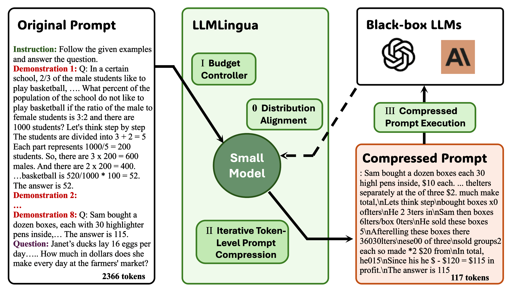
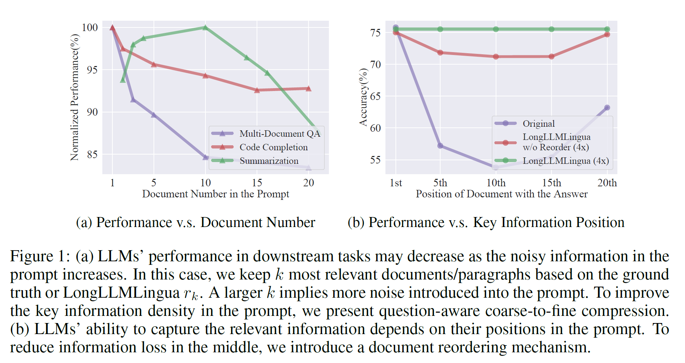

<div style="display: flex; align-items: center; ">  
    <div style="width: 100px; margin-right: 10px; height:auto;" align="left">  
          
    </div>  
    <div style="flex-grow: 1;" align="center">  
        <h2 align="center">LLMLingua: Compressing Prompts for Accelerated Inference of Large Language Models & LongLLMLingua</h1>  
    </div>  
</div>

<p align="center">
| <a href="https://llmlingua.com/"><b>Project Page</b></a>| <a href="https://arxiv.org/abs/2310.05736"><b>LLMLingua Paper</b></a> | <a href="https://arxiv.org/abs/2310.06839"><b>LongLLMLingua Paper</b></a> | <a href="https://huggingface.co/spaces/microsoft/LLMLingua"><b>HF Space Demo</b></a> |
</p>

https://github.com/microsoft/LLMLingua/assets/30883354/eb0ea70d-6d4c-4aa7-8977-61f94bb87438

## News

- 🎈 We launched a [project page](https://llmlingua.com/) showcasing real-world case studies, including RAG, Online Meetings, CoT, and Code;
- 👾 LongLLMLingua has been incorporated into the [LlamaIndex pipeline](https://github.com/run-llama/llama_index/blob/main/llama_index/indices/postprocessor/longllmlingua.py), which is a widely used RAG framework.

## Tl;DR

LLMLingua, that uses a well-trained small language model after alignment, such as GPT2-small or LLaMA-7B, to detect the unimportant tokens in the prompt and enable inference with the compressed prompt in black-box LLMs, achieving up to 20x compression with minimal performance loss.

[LLMLingua: Compressing Prompts for Accelerated Inference of Large Language Models](https://arxiv.org/abs/2310.05736) (EMNLP 2023).<br>
_Huiqiang Jiang, Qianhui Wu, Chin-Yew Lin, Yuqing Yang and Lili Qiu_

LongLLMLingua is a method that enhances LLMs' ability to perceive key information in long-context scenarios using prompt compression, achieveing up to $28.5 in cost savings per 1,000 samples while also improving performance.

[LongLLMLingua: Accelerating and Enhancing LLMs in Long Context Scenarios via Prompt Compression](https://arxiv.org/abs/2310.06839) (Under Review).<br>
_Huiqiang Jiang, Qianhui Wu, Xufang Luo, Dongsheng Li, Chin-Yew Lin, Yuqing Yang and Lili Qiu_

## 🎥 Overview


- Have you ever tried to input a long text and ask ChatGPT to summarize it, only to be told that it exceeds the token limit? ​
- Have you ever spent a lot of time fine-tuning the personality of ChatGPT, only to find that it forgets the previous instructions after a few rounds of dialogue? ​
- Have you ever used the GPT3.5/4 API for experiments, and got good results, but also received a huge bill after a few days? ​

Large language models, such as ChatGPT and GPT-4, impress us with their amazing generalization and reasoning abilities, but they also come with some drawbacks, such as the prompt length limit and the prompt-based pricing scheme.​



Now you can use **LLMLingua** & **LongLLMLingua**!​

A simple and efficient method to compress prompt up to **20x**.​

- 💰 **Saving cost**, not only prompt, but also the generation length;​
- 📝 **Support longer contexts**, enhance the density of key information in the prompt and mitigate loss in the middle, thereby improving overall performance.
- ⚖️ **Robustness**, no need any training for the LLMs;​
- 🕵️ **Keeping** the original prompt knowledge like ICL, reasoning, etc.​
- 📜 **KV-Cache compression**, speedup inference;​




If you find this repo helpful, please cite the following paper:

```bibtex
@inproceedings{jiang-etal-2023-llmlingua,
    title = "LLMLingua: Compressing Prompts for Accelerated Inference of Large Language Models",
    author = "Huiqiang Jiang and Qianhui Wu and Chin-Yew Lin and Yuqing Yang and Lili Qiu",
    booktitle = "Proceedings of the 2023 Conference on Empirical Methods in Natural Language Processing",
    month = dec,
    year = "2023",
    publisher = "Association for Computational Linguistics",
    url = "https://arxiv.org/abs/2310.05736",
}
```
```bibtex
@article{jiang-etal-2023-longllmlingua,
    title = "LongLLMLingua: Accelerating and Enhancing LLMs in Long Context Scenarios via Prompt Compression",
    author = "Huiqiang Jiang and Qianhui Wu and and Xufang Luo and Dongsheng Li and Chin-Yew Lin and Yuqing Yang and Lili Qiu",
    url = "https://arxiv.org/abs/2310.06839",
    journal = "ArXiv preprint",
    volume = "abs/2310.06839",
    year = "2023",
}
```

## 🎯 Quick Start

Install LLMLingua,

```bash
pip install llmlingua
```
    
Then, you can use LLMLingua to compress your prompt,
    
```python
from llmlingua import PromptCompressor

llm_lingua = PromptCompressor()
compressed_prompt = llm_lingua.compress_prompt(prompt, instruction="", question="", target_token=200)

# > {'compressed_prompt': 'Question: Sam bought a dozen boxes, each with 30 highlighter pens inside, for $10 each box. He reanged five of boxes into packages of sixlters each and sold them $3 per. He sold the rest theters separately at the of three pens $2. How much did make in total, dollars?\nLets think step step\nSam bought 1 boxes x00 oflters.\nHe bought 12 * 300ters in total\nSam then took 5 boxes 6ters0ters.\nHe sold these boxes for 5 *5\nAfterelling these  boxes there were 3030 highlighters remaining.\nThese form 330 / 3 = 110 groups of three pens.\nHe sold each of these groups for $2 each, so made 110 * 2 = $220 from them.\nIn total, then, he earned $220 + $15 = $235.\nSince his original cost was $120, he earned $235 - $120 = $115 in profit.\nThe answer is 115',
#  'origin_tokens': 2365,
#  'compressed_tokens': 211,
#  'ratio': '11.2x',
#  'saving': ', Saving $0.1 in GPT-4.'}
```

You can refer to this [document](./DOCUMENT.md) for more recommendations on how to use LLMLingua effectively.

## Frequently Asked Questions

show in [Transparency_FAQ.md](./Transparency_FAQ.md)

## Contributing

This project welcomes contributions and suggestions.  Most contributions require you to agree to a
Contributor License Agreement (CLA) declaring that you have the right to, and actually do, grant us
the rights to use your contribution. For details, visit https://cla.opensource.microsoft.com.

When you submit a pull request, a CLA bot will automatically determine whether you need to provide
a CLA and decorate the PR appropriately (e.g., status check, comment). Simply follow the instructions
provided by the bot. You will only need to do this once across all repos using our CLA.

This project has adopted the [Microsoft Open Source Code of Conduct](https://opensource.microsoft.com/codeofconduct/).
For more information see the [Code of Conduct FAQ](https://opensource.microsoft.com/codeofconduct/faq/) or
contact [opencode@microsoft.com](mailto:opencode@microsoft.com) with any additional questions or comments.

## Trademarks

This project may contain trademarks or logos for projects, products, or services. Authorized use of Microsoft 
trademarks or logos is subject to and must follow 
[Microsoft's Trademark & Brand Guidelines](https://www.microsoft.com/en-us/legal/intellectualproperty/trademarks/usage/general).
Use of Microsoft trademarks or logos in modified versions of this project must not cause confusion or imply Microsoft sponsorship.
Any use of third-party trademarks or logos are subject to those third-party's policies.
